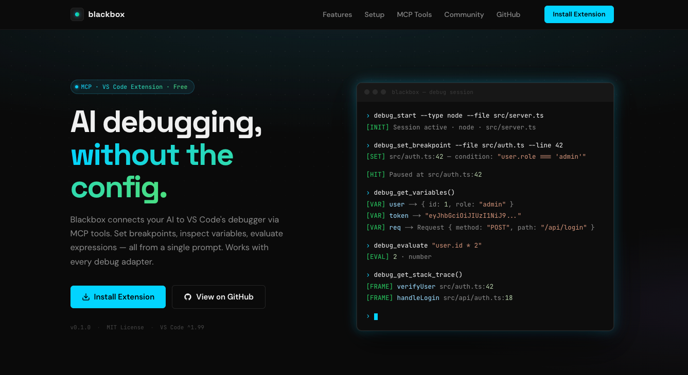

# ⬛ Blackbox

**AI-driven debugging for any language — set breakpoints, start/stop debug sessions, inspect variables, and navigate code via [MCP](https://modelcontextprotocol.io/) tools.**

## Overview

[Blackbox](https://blackbox.xcode.cx/) is a powerful AI-driven debugging tool for any language. It allows AI to seamlessly set breakpoints, start/stop debug sessions, inspect variables, and navigate code using [MCP](https://modelcontextprotocol.io/) tools. It works out-of-the-box with any Debug Adapter Protocol (DAP) compatible debugger, including PHP, Node.js, Python, Go, C/C++, Java, and more!

Made with ❤️ by [Akash Aman](https://linktr.ee/akash_aman)

---

 

## ✨ Key Features (Tool Contract)

All IDE implementations expose the same consistent set of tools defined in [`schema/tools.json`](schema/tools.json):

| Tool | Description | Category |
|------|-------------|----------|
| Set Breakpoint | Place a breakpoint at any file and line, with an optional condition or log message. | debug |
| Remove Breakpoint | Remove an existing breakpoint by file path and line number. | debug |
| List Breakpoints | List all active breakpoints — file, line, condition, and hit count. | debug |
| Start Session | Start a debug session for any language — PHP, Node, Python, Go, C++, and more. | debug |
| Stop Session | Stop the currently active debug session cleanly. | debug |
| Evaluate Expression | Run any expression in the current debug context — call functions, inspect values. | debug |
| Get Variables | Fetch all in-scope variables when paused; expand nested objects and arrays. | debug |
| Get Stack Trace | Inspect the full call stack — file, line number, and function name per frame. | debug |
| Open File | Open any file in the editor and optionally scroll to a specific line. | editor |
| List Open Files | List all open editor tabs with their active and unsaved-changes status. | editor |
| Find File | Search for files in the workspace by glob pattern. | workspace |
| Get Diagnostics | Pull errors and warnings from every language server; filter by severity. | workspace |

## 📚 IDE Support

This project contains implementations for the following editors:

| IDE | Status | Directory |
|-----|--------|-----------|
| **VS Code** | Active | [`editors/vscode/`](editors/vscode/) |
| **JetBrains** | Planned | [`editors/jetbrains/`](editors/jetbrains/) |
| **Neovim** | Planned | [`editors/neovim/`](editors/neovim/) |

## 📚 Packages in this Monorepo

This repository contains the following packages:

### │ 📦 [Blackbox Debug ( VS Code Extension )](https://marketplace.visualstudio.com/items?itemName=akash-cx.blackbox-debug)

The core debugging engine that powers Blackbox. It provides framework-agnostic MCP tool implementations for breakpoint management, debug session control, variable inspection, and code navigation. You can use this package to integrate Blackbox debugging with any IDE (VS Code, JetBrains, Neovim, etc.) or with custom editor implementations.

➡️ **[View the detailed `akash-cx.blackbox-debug` README](./editors/vscode/README.md)**

## 🤝 Contributing

Contributions, issues, and feature requests are welcome\! Feel free to check the [issues page](https://github.com/akash-aman/blackbox/issues).

## 📝 License

This project is [MIT](./LICENSE) licensed.

---

### Made with ❤️ by [Akash Aman](https://linktr.ee/akash_aman)

