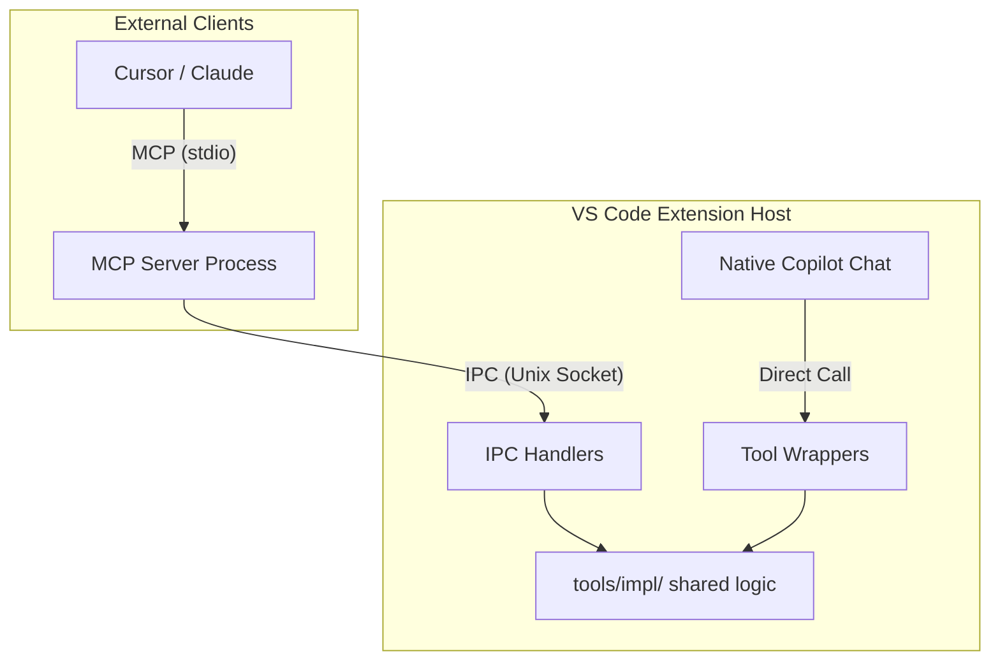

This restructuring sharpens the technical flow, emphasizing the "Single Source of Truth" and the dual-path execution model.

---

# Blackbox Architecture

## Executive Summary
Blackbox provides a unified interface between AI models and IDEs via the **Model Context Protocol (MCP)**. It abstracts complex debugging and editor operations into a standardized toolset, allowing any MCP-compliant client to control diverse development environments.

## The Core Contract
To ensure consistency across different IDEs (VS Code, JetBrains, etc.), Blackbox utilizes a centralized schema.

* **Source of Truth:** [`/schema/tools.json`](/schema/tools.json) defines the canonical names, descriptions, and input parameters.
* **Implementation Rule:** Each IDE implementation is independent but must strictly adhere to this JSON contract.

### Tool Taxonomy
| Category | Functional Scope |
| :--- | :--- |
| **Breakpoints** | Lifecycle management: `set`, `remove`, `list`. |
| **Session** | Lifecycle control: `start`, `stop`, `restart`. |
| **Execution** | Stepping logic: `continue`, `pause`, `step_over`, `step_into`, `step_out`. |
| **Inspection** | State analysis: `evaluate`, `variables`, `stack_trace`, `watch`. |
| **Editor** | File interaction: `open_file`, `get_open_files`. |
| **Workspace** | Environment context: `find_file`, `get_diagnostics`. |

---

## VS Code Implementation
The VS Code architecture is designed for **convergence**. It allows both internal VS Code features and external MCP clients to trigger the same logic without code duplication.

### Technical Workflow
1.  **Native Path (`languageModelTools`):** VS Code's internal chat (e.g., Copilot) accesses tools via thin wrappers in `tools/*.ts`.
2.  **External Path (MCP Server):** External clients (Cursor, Claude Desktop) connect to `mcp/server.ts` via stdio. This server communicates with the Extension Host through a **Unix Socket** (newline-delimited JSON).
3.  **Unified Implementation:** Both paths resolve to `tools/impl/*`, ensuring that a `debug_step_over` command behaves identically regardless of the trigger source.

### Communication Flow

---

## Extension Guide: Adding New IDEs
To integrate a new editor into the Blackbox ecosystem, follow these steps:

1.  **Namespace:** Create a new directory under `editors/<ide>/`.
2.  **Compliance:** Implement the functions defined in `schema/tools.json` using the target IDE's native APIs.
3.  **Transport:** Expose the implementation via an MCP-compliant transport (typically stdio or a native IDE plugin API).
4.  **Automation:** Register a dedicated CI workflow in `.github/workflows/<ide>.yml` to validate implementation against the schema.