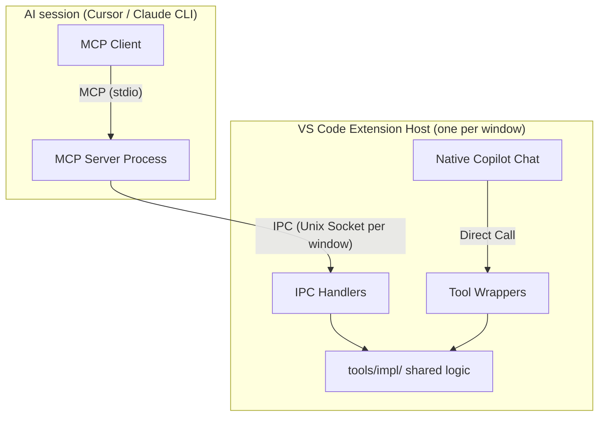

This restructuring sharpens the technical flow, emphasizing the "Single Source of Truth" and the dual-path execution model.

---

# Blackbox Architecture

## Executive Summary
Blackbox provides a unified interface between AI models and IDEs via the **Model Context Protocol (MCP)**. It abstracts complex debugging and editor operations into a standardized toolset, allowing any MCP-compliant client to control diverse development environments.

## The Core Contract
To ensure consistency across different IDEs (VS Code, JetBrains, etc.), Blackbox utilizes a centralized schema.

* **Source of Truth:** [`/schema/tools.json`](/schema/tools.json) defines the canonical names, descriptions, and input parameters.
* **Implementation Rule:** Each IDE implementation is independent but must strictly adhere to this JSON contract.

### Tool Taxonomy
| Category | Functional Scope |
| :--- | :--- |
| **Breakpoints** | Lifecycle management: `set`, `remove`, `list`. |
| **Session** | Lifecycle control: `start`, `stop`, `restart`. |
| **Execution** | Stepping logic: `continue`, `pause`, `step_over`, `step_into`, `step_out`. |
| **Inspection** | State analysis: `evaluate`, `variables`, `stack_trace`, `watch`. |
| **Editor** | File interaction: `open_file`, `get_open_files`. |
| **Workspace** | Environment context: `find_file`, `get_diagnostics`. |

---

## VS Code Implementation
The VS Code architecture is designed for **convergence**. It allows both internal VS Code features and external MCP clients to trigger the same logic without code duplication.

### Technical Workflow
1.  **Native Path (`languageModelTools`):** VS Code's internal chat (e.g., Copilot) accesses tools via thin wrappers in `tools/*.ts`.
2.  **External Path (MCP Server):** External clients (Cursor, Claude Desktop) connect to `mcp/server.ts` via stdio. This server communicates with the Extension Host through a **Unix Socket** (newline-delimited JSON). Each editor window (VS Code, Cursor, Antigravity, …) listens on its own socket, `/tmp/blackbox-<uid>/<pid>.sock`, and writes `/tmp/blackbox-<uid>/<pid>.json` describing itself: folders, editor name and version, the editor's main process, and the extension and protocol versions (see [Choosing a window](#choosing-a-window)).
3.  **Unified Implementation:** Both paths resolve to `tools/impl/*`, ensuring that a `debug_step_over` command behaves identically regardless of the trigger source.

### Communication Flow

```mermaid
graph TD
    subgraph "AI session (Cursor / Claude CLI)"
        A[MCP Client] -- "MCP (stdio)" --> B[MCP Server Process]
    end

    B -- "IPC (Unix Socket per window)" --> C

    subgraph "VS Code Extension Host (one per window)"
        C[IPC Handlers]
        D[Native Copilot Chat] -- "Direct Call" --> E[Tool Wrappers]
        
        C --> F[tools/impl/ shared logic]
        E --> F
    end
```

### The IPC directory
Sockets and registry files live in `/tmp/blackbox-<uid>/` (`%TEMP%\blackbox` and named pipes on Windows), one directory per user. The extension creates it with mode `0700` and refuses to start if it is a symlink, owned by someone else, or reachable by other users. The MCP server ignores a directory that fails the same check, so another local user can't plant registry entries. Sockets are named after the extension host's pid, so windows from different editors never clash. Until 0.4.0 the MCP server also reads the old shared `/tmp/blackbox/`, so windows still on 0.2.0 stay visible.

### Choosing a window
The MCP server is started by the AI client, one per AI session, not by the editor. On every call its `BridgeSession` (`mcp/session.ts`) decides which window to use:

1. `BLACKBOX_SOCKET`, if set.
2. The window pinned with `ide_select_window`. After a reload it is found again by its folders. If it has closed, the call fails; the session never switches windows on its own.
3. The single window whose folder contains the server's working directory (or `BLACKBOX_WORKSPACE`). A window opened on a sub-folder of that directory also counts.
4. If several windows match (e.g. the project is open in VS Code and in Cursor): the one this session was launched from (`mcp/launch.ts`):
   * `BLACKBOX_WINDOW`, which each window sets in its integrated terminals;
   * a window whose extension host is a parent process (an AI chat panel inside that window);
   * otherwise the windows of the editor whose main process is an ancestor.
5. If none match: the window this session was launched from, or the only running window.

Anything else returns an error listing the candidates with their editor and debugger state, so the AI can call `ide_list_windows` and `ide_select_window` (optionally with `app`). `ide_list_windows` also asks each window for its live state (`window_status`) and shows `launchedFrom` and `outdated` for each.

### Following the debugger
`DebugEventHub` (`tools/impl/events.ts`, logic in `tools/impl/debugEvents.ts`) watches every debug session's DAP traffic through a debug adapter tracker. It records adapter capabilities, the last pause of each session, and the last 1,000 output entries, which include logpoint messages. `debug_wait_for_stop`, the step tools and `debug_get_output` are built on it. Waits start listening before the request is sent, so a fast pause is never missed. They cover all sessions, because some adapters (js-debug) pause a child session. Breakpoint changes wait briefly for the adapter's `setBreakpoints` response, so a continue right after a change can't race it.

Layers on the MCP side, each depending only on the ones below:

| File | Responsibility |
| :--- | :--- |
| `mcp/server.ts` | Tool registration and result formatting |
| `mcp/session.ts` | Routing policy and the per-session pin |
| `mcp/launch.ts` | Which window or editor launched this session |
| `ipc/registry.ts` | Discovering windows and matching folders |
| `ipc/client.ts` | Sending one request to one socket, with retries |
| `ipc/protocol.ts` | Wire types, socket/registry paths, directory checks |

---

## Extension Guide: Adding New IDEs
To integrate a new editor into the Blackbox ecosystem, follow these steps:

1.  **Namespace:** Create a new directory under `editors/<ide>/`.
2.  **Compliance:** Implement the functions defined in `schema/tools.json` using the target IDE's native APIs.
3.  **Transport:** Expose the implementation via an MCP-compliant transport (typically stdio or a native IDE plugin API).
4.  **Automation:** Register a dedicated CI workflow in `.github/workflows/<ide>.yml` to validate implementation against the schema.